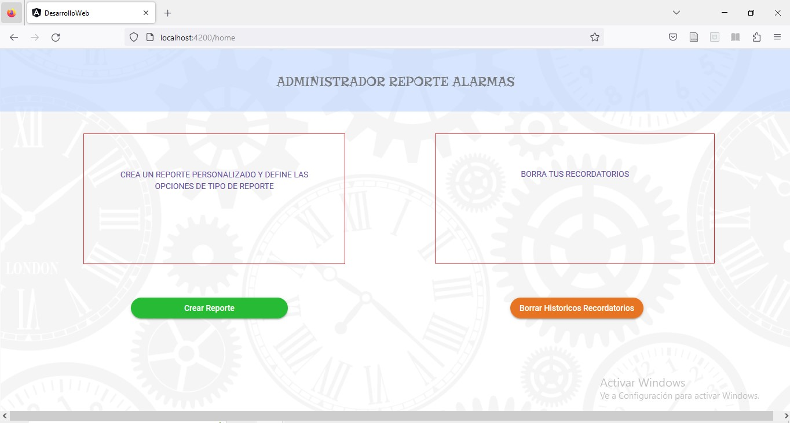
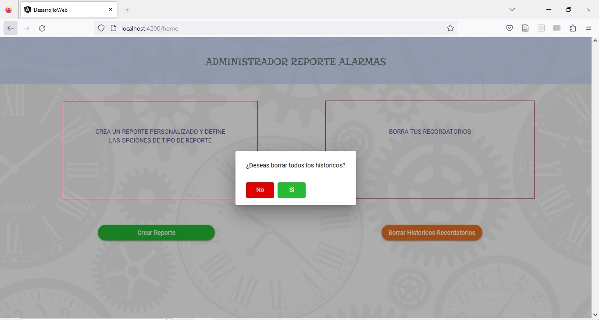
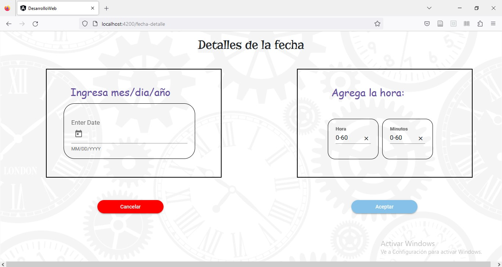
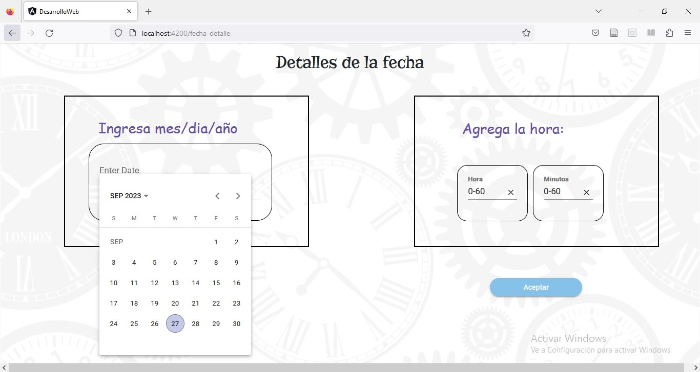
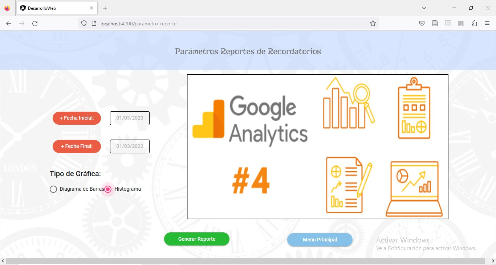
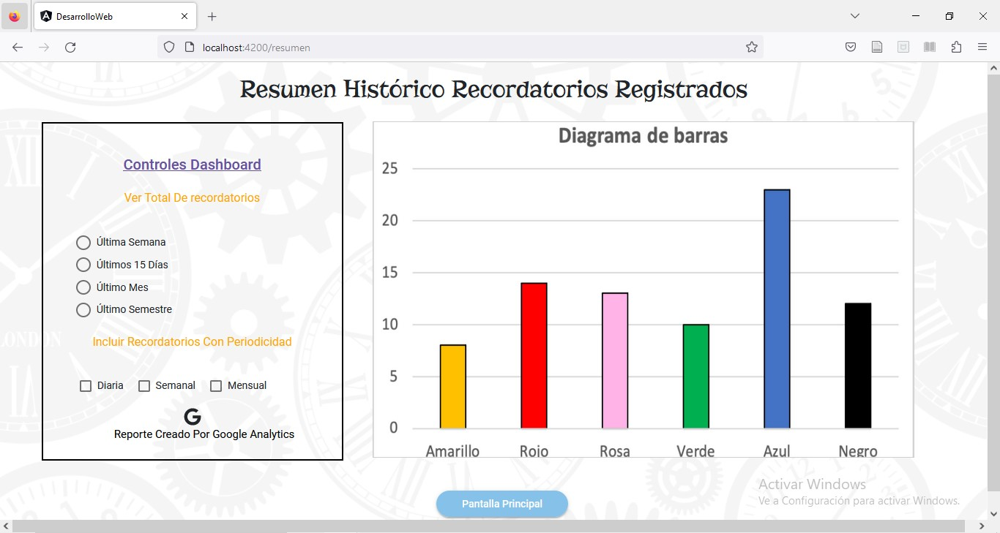

# UX_Proyecto_Final_2023

# Desarrollo WEB en Angular

1. Para poder ejecutar la aplicación, es necesario tener instalado en el equipo que se vaya a ejecutar la version de Node 16.15.1. Una vez descargado el codigo, ubicarse en el folder "Desarrollo Web" y ejecutar el comando:

        npm install

2. Una vez finalizada la instalación de librerias, inicie la aplicación con el comando:

        ng server -o

3. Al cargar la aplicación, se abrirá el navegador web por el puerto 4200 con la página principal:

4. Si le damos click en el botón para “Borrar Historicos Recordatorios”, tendremos la ventana de confirmación:

5. Ya sea que le demos Si o No, nos devolverá a la pantalla principal. Luego podemos hacer click en el botón “Crear Reporte” nos lleva a la siguiente pantalla:

6. Si elegimos la “Fecha Inicial” o “Fecha Final” nos lleva a la pantalla donde podemos dar más detalle de la fecha a elegir para crear un reporte histórico:

7. Una vez seleccionada la fecha, dando click en Aceptar o Cancelar nos devuelve a la pantalla anterior y podemos elegir el tipo de grafica que prefiere el usuario:

8. Si damos click en “Menu Principal” nos enviara a la pantalla inicial. Si damos click en “Generar Reporte” iremos a la gráfica con el Dashboard, donde se ve el logo de Google Analytics y un Dashboard con botones de control:

