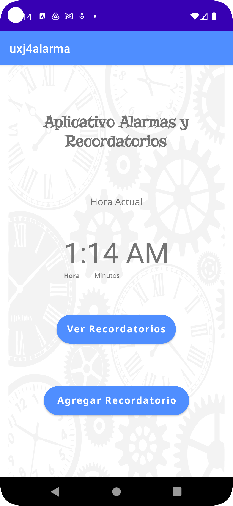
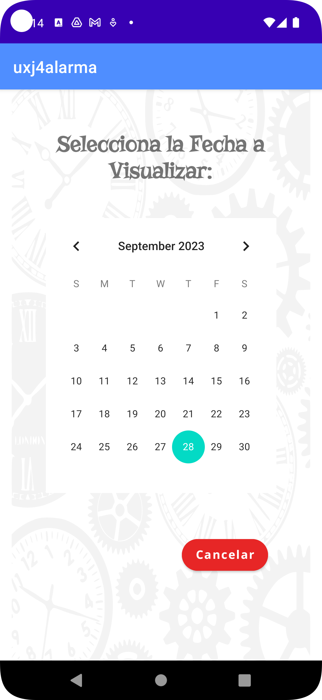
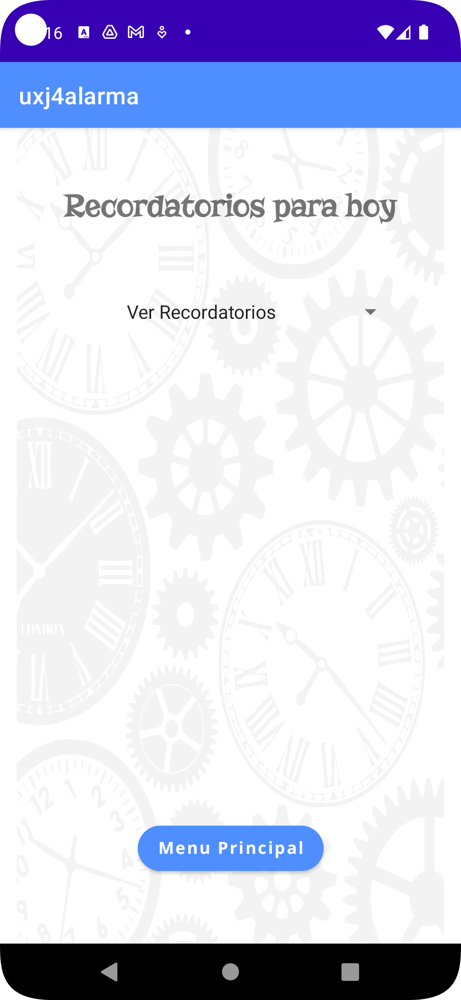
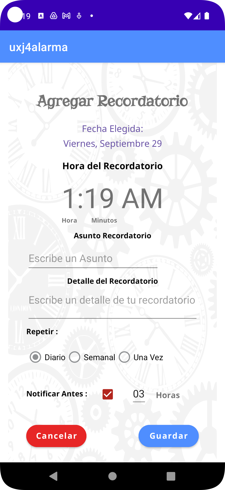
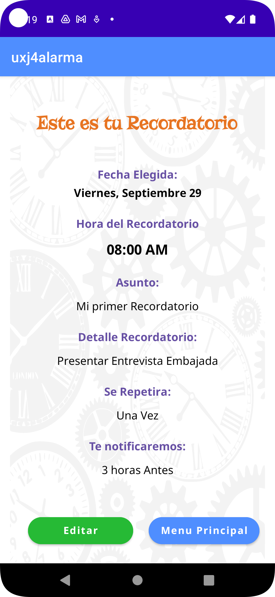
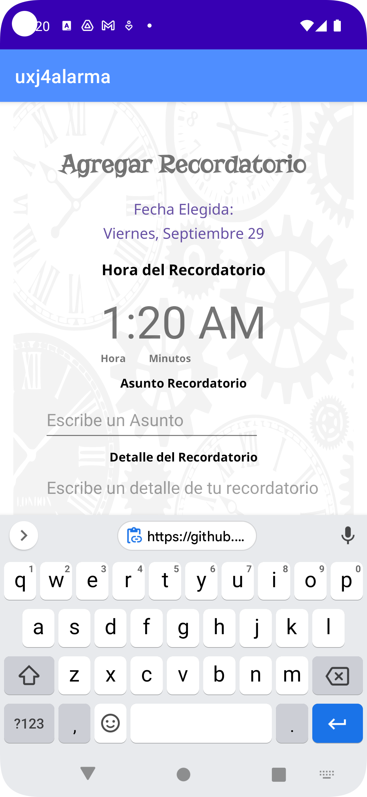

# UX_Proyecto_Final_2023

# Pantallas realizadas

1. Mario Gomez realizó las siguientes pantallas:

<li>Pantalla Home Angular</li>
<li>Pantalla Parámetros Angular</li>
<li>Pantalla Principal Mobile</li>
<li>Pantalla Formulario Mobile</li>
<li>Pantalla Confirmación Mobile</li>

 

2. Nelson Ortiz realizó las siguientes pantallas:

<li>Pantalla Detalles Fechas</li>
<li>Pantalla Resumen Histórico</li>
<li>Pantalla Principal Mobile</li>
<li>Pantalla Calendario</li>
<li>Pantalla Lista Recordatorios</li>

 

# Desarrollo WEB en Angular

1. Para poder ejecutar la aplicación, es necesario tener instalado en el equipo que se vaya a ejecutar la version de Node 16.15.1. Una vez descargado el codigo, ubicarse en el folder "Desarrollo Web" y ejecutar el comando:

        npm install

2. Una vez finalizada la instalación de librerias, inicie la aplicación con el comando:

        ng server -o

3. Al cargar la aplicación, se abrirá el navegador web por el puerto 4200 con la página principal:

4. Si le damos click en el botón para “Borrar Historicos Recordatorios”, tendremos la ventana de confirmación:

5. Ya sea que le demos Si o No, nos devolverá a la pantalla principal. Luego podemos hacer click en el botón “Crear Reporte” nos lleva a la siguiente pantalla:

6. Si elegimos la “Fecha Inicial” o “Fecha Final” nos lleva a la pantalla donde podemos dar más detalle de la fecha a elegir para crear un reporte histórico:

7. Una vez seleccionada la fecha, dando click en Aceptar o Cancelar nos devuelve a la pantalla anterior y podemos elegir el tipo de grafica que prefiere el usuario:

8. Si damos click en “Menu Principal” nos enviara a la pantalla inicial. Si damos click en “Generar Reporte” iremos a la gráfica con el Dashboard, donde se ve el logo de Google Analytics y un Dashboard con botones de control:

# Desarrollo Mobile con Kotlin

1. Para el desarrollo Mobile puede usar el APK que se encuentra en el folder "APK" o puede cargar el proyecto en la ultima versión de Android Studio y ejecutarlo con el simulador. En ambos casos, la primera pantalla que visualizara sera la principal:

2. Si da click en "Ver Recordatorios", aparecera el calendario:

3. Si le da click al botón "Cancelar" regresara a la pantalla principal. Si selecciona una fecha, lo envia a la pantalla del listado de recordatorios:

4. Damos click en el botón "Menu Principal" y nos trae devuelta a la pantalla inicial. Damos ahora click en el botón "Agregar Recordatorio": 

5. Esto nos abre el formulario para registrar un recordatorio. Si le damos click en "Cancelar" nos devuelve a la pantalla inicial:

6. Si le damos click en "Guardar" nos envia a la pantalla de confirmación que se ha registrado correctamente:

7. Si le damos click en el botón "Menu Principal" nos envia a la pantalla principal. En caso de que demos click en el botón "Editar" podremos editar la información ingresada nuevamente:

8. De esta manera se documenta tanto el uso de la aplicacion Mobile como Web.

